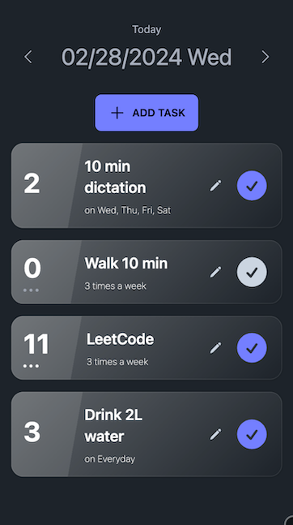

# Streakist

A simple habit/task tracker app

## Screenshot

Task List             |  Task Add/Edit Dialog
:-------------------------:|:-------------------------:
  |  

## Technologies

- React
- TypeScript
- Tailwind CSS
- DaisyUI

## Getting Started

To run the app, install Node.js (>= v18) and run the following commands:

```bash
npm install
npm start
```

## Architecture Pattern

The app adopts Provider Pattern for separating states and UI components, leading to a clean architecture. All data sources are defined and managed in the `TaskContext`. Then, the entire component tree is wrapped with `TaskContextProvider` which provides the necessary data and relevant method for the child components. This way, all UI components in the tree can access the data via `useTaskContext()`, a hook to use TaskContext easily, and perform necessary operations while avoiding prop drilling. 

## Testing Strategy

The project includes unit tests for complex business logic (such as streak calculation) using Jest.

To run the tests, run the following command:

```bash
npm test
```

## TODO

- [x] Task should not be displayed when the current day is not the specified day
- [x] Task edit and delete functionality
- [x] Improve task list UI
- [x] Check rendering performance
- [x] Check in both dark and light mode
- [x] Write README
- [x] Add necessary comments
